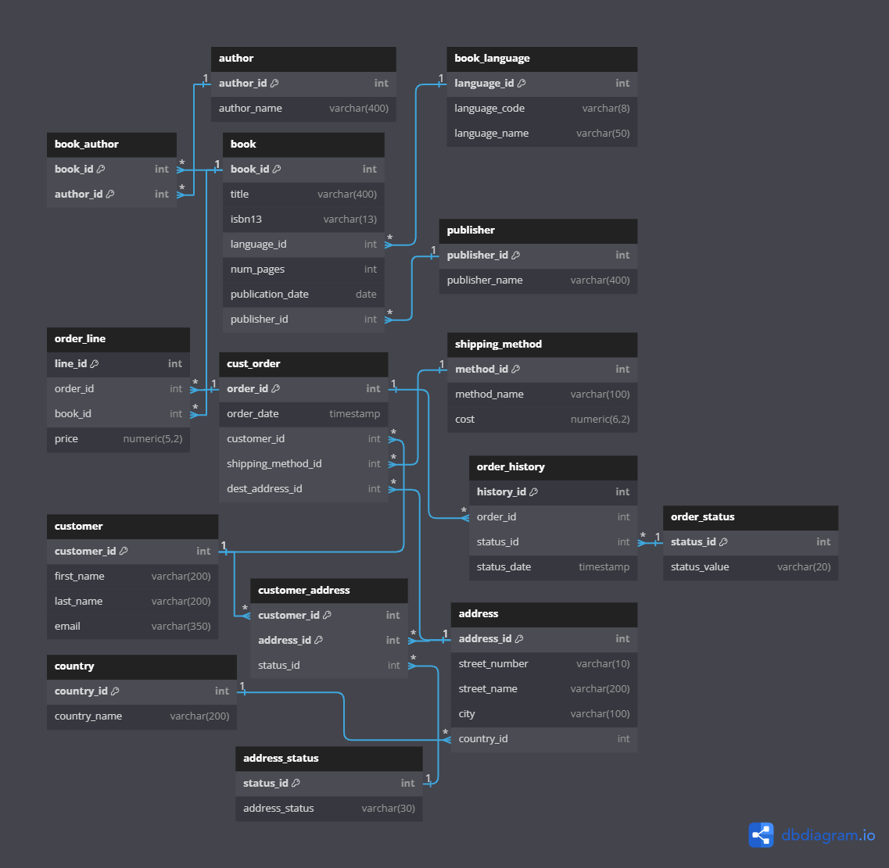
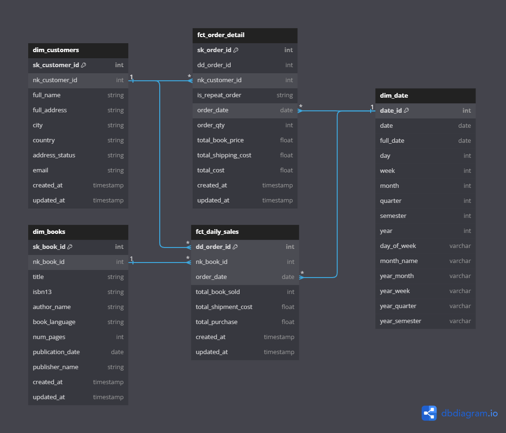
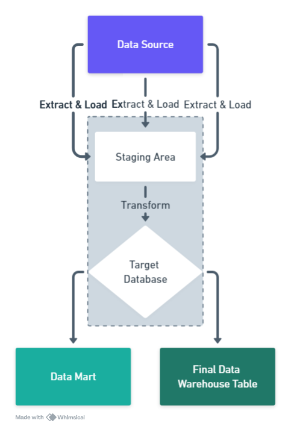

# Data Warehouse for Online Bookstore

## Table of Contents
1. [Requirements Gathering & Solution](#requirements-gathering--solution)
2. [Proposed Solutions](#proposed-solutions)
3. [Design Dimensional Model Process](#design-dimensional-model-process)
4. [ERD Source and Final Plan](#erd-source-and-final-plan)
5. [Business Processes and Details](#business-processes-and-details)
6. [Design of the ETL Pipeline](#design-of-the-etl-pipeline)
7. [Stack or Tools or Libraries Used](#stack-or-tools-or-libraries-used)
8. [Running the ETL Pipeline](#running-the-etl-pipeline)
9. [Orchestrate ELT with Luigi](#orchestrate-elt-with-luigi)
10. [References](#references)

---

## Requirements Gathering & Solution

### 1. **What kind of reports do you need from the Data Warehouse?**
   - "We need reports that summarize daily sales, show customer orders, and provide detailed histories of all orders."

### 2. **How often do you need updates to the sales data?**  
   - "We need the sales data to be updated every day so we can track our performance in real time."

### 3. **How do you define a successful order?**  
   - "An order is considered successful when it has been delivered to the customer."

### 4. **What are the key metrics you want to track for sales?**
   - "We want to track daily sales, the number of books sold, total revenue, and shipping costs."

### 5. **What are your future goals for data analysis?**
   - "We want to understand customer buying habits better and use that information to improve our marketing efforts."

### 6. **How should we handle changes to customer, product, or order data over time?**  
   - "For data like customer details, product information, and order status, we should keep a record of changes as they happen, so we can always see the history of each item."

### 7. **Which data should be updated regularly versus stored with versioning for history?**  
   - "Data like customer information or product details should be stored in a way that we can track changes over time (like keeping past versions), while sales and order data can be updated daily without needing to store versions."

---

## Proposed Solutions

### Description
The project aims to create a Data Warehouse for a company that sells books online. This Data Warehouse will integrate data from various sources to enable comprehensive reporting and analysis, focusing on book sales, customer orders, and shipping details.

### Problem
The company currently experiences difficulties in generating analytical reports from its transactional database. This limitation results in suboptimal performance for both transactional and analytical operations.

### Solution
The proposed solution is to design a Data Warehouse with a dimensional model that includes fact tables for daily sales and order details, and dimension tables for books, customers, and dates. An ETL pipeline will be implemented to extract, transform, and load data into the Data Warehouse, enabling the company to generate insightful reports, improve decision-making and also better operational efficiency.

- **Dimensional Model**: Design a star schema with fact tables for sales and order details and dimension tables for books, customers, and dates.
- **ETL Pipeline**: Develop a robust ETL pipeline to handle data extraction, transformation, and loading into the Data Warehouse.

---

## Design Dimensional Model Process

The dimensional model is designed to enable efficient querying and reporting by organizing data into facts and dimensions. The main components include:

- **Fact Tables**: `fct_daily_sales`, `fct_order_detail`
- **Dimension Tables**: `dim_books`, `dim_customers`, `dim_date`

| **Fact Table / Dimension** | **dim_books** | **dim_customers** | **dim_date** |
|----------------------------|---------------|-------------------|--------------|
| **fct_daily_sales**         | X             | X                 | X            |
| **fct_order_detail**        |               | X                 | X            |

---

## ERD Source and Final Plan

### ERD Source


### ERD Final Plan


---

## Business Processes and Details

### Business Process: Order Transaction

- **Declare Grain:**
  - Each record in the fact table will represent a single product purchase within an order (fine grain).
  - Aggregate records representing daily sales totals for each product.

- **Identify the Dimensions:**
  - `dim_customers`
  - `dim_books`

- **Identify the Facts:**
  - `fct_order_detail` (Transactional Fact Table Type)
  - `fct_daily_sales` (Accumulating Snapshot Fact Table Type)

---

### Business Process and Performance Metric Table

| **Business Process**         | **Performance Metric**                          |
|------------------------------|---------------------------------------------|
| **Order Detail**              | Quantity sold, sale price, order date       |
| **Daily Sales**               | Total sales quantity, total sales revenue, total shipping cost |

---

## Design of the ETL Pipeline

The ETL pipeline will extract data from source systems, transform it into a format suitable for the Data Warehouse, and load it into the respective tables.



### Workflow Description

1. **Extraction:** Data is extracted from PostgreSQL databases using Python, Pangres, and Luigi.
2. **Loading:** Data is loaded into public and staging schemas in the data warehouse.
3. **Transformation:** DBT transforms the data into data marts and the final data warehouse.

---

## Stack or Tools or Libraries Used

- **Database**: PostgreSQL
- **ETL Framework**: dbt (Data Build Tool)
- **Programming Language**: SQL, Python
- **Orchestration**: Luigi
- **Deployment**: Docker

---

## Running the ETL Pipeline

1. **Clone the repository**:  
   ```bash
   git clone <repo_url>
   ```

2. **Create a `.env` file with the following variables**:
   ```env
   # Source
   SRC_POSTGRES_DB=pacbook
   SRC_POSTGRES_HOST=localhost
   SRC_POSTGRES_USER=[YOUR USERNAME]
   SRC_POSTGRES_PASSWORD=[YOUR PASSWORD]
   SRC_POSTGRES_PORT=[YOUR PORT]

   # SENTRY DSN
   SENTRY_DSN=... # Fill with your Sentry DSN Project

   # DWH
   DIR_ROOT_PROJECT=... # <project_dir>
   DIR_TEMP_LOG=... # <project_dir>/pipeline/temp/log
   DIR_TEMP_DATA=... # <project_dir>/pipeline/temp/data
   DIR_EXTRACT_QUERY=... # <project_dir>/pipeline/src_query/extract
   DIR_LOAD_QUERY=... # <project_dir>/pipeline/src_query/load
   DIR_TRANSFORM_QUERY=... # <project_dir>/pipeline/src_query/transform
   DIR_LOG=... # <project_dir>/logs/
   ```

3. **Run Data Sources & Data Warehouses**:
   ```bash
   docker compose up -d
   ```

4. **Ensure the `/helper/source/init.sql` script has the data preloaded.**

5. **Run `elt_main.py` to execute the pipeline.**

6. **Monitor logs in the `/logs/logs.log/` directory for any errors.**

---

### Run this command in the background process:
```bash
luigid --port 8082
```

### To run the pipeline directly from the terminal:
```bash
python3 elt_main.py
```

### Alternatively, schedule the pipeline using cron to run every hour:
```bash
0 * * * * <project_dir>/elt_run.sh
```

---

## Orchestrate ELT with Luigi

### Setup Instructions

1. **Python & Luigi**: Install required Python packages and set up Luigi for orchestration.
2. **DBT Models**: Develop DBT models for transforming data into the desired schema.
3. **Cron Scheduling**: Schedule data updates using cron jobs for continuous data flow.

In the project directory, **create and use a virtual environment**.  
Then install dependencies with:
```bash
pip install -r requirements.txt
```

---

## References

1. [DBT Documentation](https://docs.getdbt.com/)
2. [Luigi Documentation](https://luigi.readthedocs.io/)
3. [Sentry SDK](https://docs.sentry.io/platforms/python/)